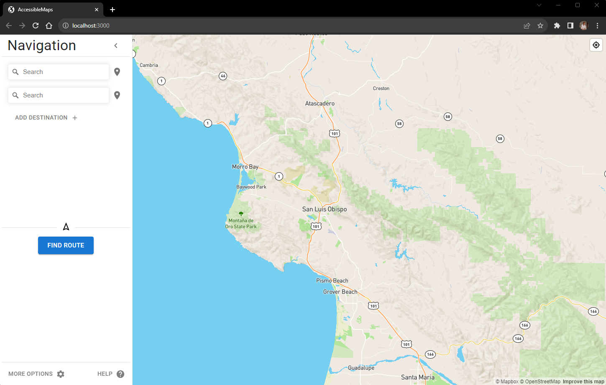
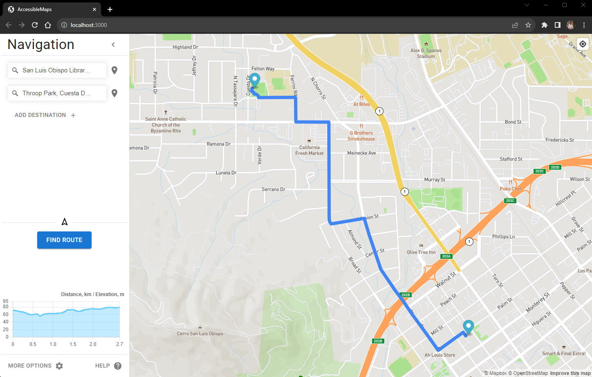
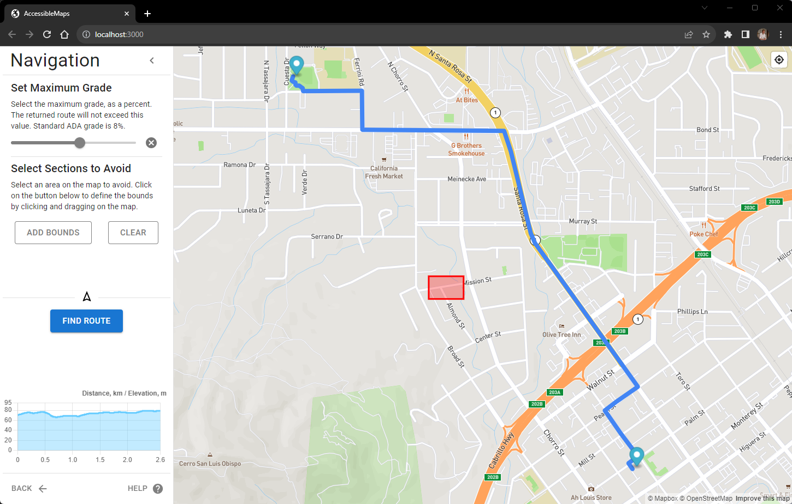

# AccessibleMaps

AccessibleMaps is a web-based application that provides ADA-compliant accessible routes for individuals with disabilities.

## Features
* Accessible routes for ADA users
* Map view for easy navigation
* Detailed directions for each route
* User-friendly interface

## For Development
* npm run frontend
* npm run backend
* [Internal Documentation](https://erikluu.notion.site/Backend-Reference-cf7a4b5bf4e74df686fd18d05d67d10c)

## More Details
Cal Poly 2023 Senior Project   
Erik Luu, Carlo Ruggiero
